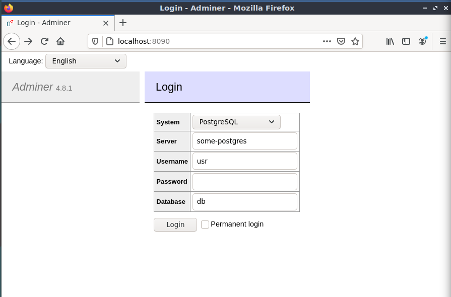

# tp-docker

## Bastien KATUSZYNSKI
## Maxime LEFEBVRE
#

# TP1

## Database
Création d'un dossier
``` 
mkdir tp1
cd tp1/
touch Dockerfile
```
```
docker pull postgres
```
Ecriture du dockerfile :
```
nano Dockerfile

>
FROM postgres:14.1-alpine
ENV POSTGRES_DB=db \
POSTGRES_USER=usr \
POSTGRES_PASSWORD=pwd
```
Création de l'image
```
docker build -t bastienkatus/postgres
```

Run l'image :
```
docker run -p 8888:5000 --name postgres bastienkatus/postgres
```
Initialisation de la database :
```
docker network create app-network
```
```
docker run \
-p "8090:8080" \
--net=app-network \
--name=adminer \
-d \
adminer
```
Création du schéma SQL :
```
touch 01-CreateScheme.sql
nano 01-CreateScheme.sql

CREATE TABLE public.departments
(
 id      SERIAL      PRIMARY KEY,
 name    VARCHAR(20) NOT NULL
);

CREATE TABLE public.students
(
 id              SERIAL      PRIMARY KEY,
 department_id   INT         NOT NULL REFERENCES departments (id),
 first_name      VARCHAR(20) NOT NULL,
 last_name       VARCHAR(20) NOT NULL
);
```
Insertion des données SQL :
```
touch 02-InsertData.sql
nano 02-InsertData.sql

INSERT INTO departments (name) VALUES ('IRC');
INSERT INTO departments (name) VALUES ('ETI');
INSERT INTO departments (name) VALUES ('CGP');

INSERT INTO students (department_id, first_name, last_name) VALUES (1, 'Eli', 'Copter');
INSERT INTO students (department_id, first_name, last_name) VALUES (2, 'Emma', 'Carena');
INSERT INTO students (department_id, first_name, last_name) VALUES (2, 'Jack', 'Uzzi');
INSERT INTO students (department_id, first_name, last_name) VALUES (3, 'Aude', 'Javel');
```

On modifie le Dockerfile : (On copie les scritps SQL sur l'image)
```
COPY [Scripts SQL] /docker-entrypoint-initdb.d/
```
On rebuild et on rerun :
```
docker build -t bastienkatus/postgres .

docker run --network app-network --name some-postgres -e POSTGRES_PASSWORD=pwd -d postgres-bastien
```
On se connecter à localhost:8090 et on peut accéder aux données


Pour la persistance des données :

On créé un volume
```
mkdir volume
```
et on relance le run avec la commande
```
docker run --network app-network --name some-postgres -e POSTGRES_PASSWORD=pwd -d postgres-bastien -v volume:/var/lib/postgresql/data
```

## Java

On créé un fichier à la source /tpJAVA

On ouvre le Dockerfile et on y insère :

### JDK -> <u>Compiler</u>
```
FROM openjdk:11
# Build Main.java
# TODO : in next steps (not now)

# Executer un fichier java -> Construction de l'image 

COPY Main.java .
RUN javac Main.java
```

### JRE -> <u>Exécuter</u>

On rajoute la ligne
```
CMD ["java", "Main"]
```
On rebuild et on relance

## Backend API

Dockerfile :
```
# Build
FROM maven:3.8.6-amazoncorretto-17 AS myapp-build
ENV MYAPP_HOME /opt/myapp
WORKDIR $MYAPP_HOME
COPY /simpleapi/pom.xml .
COPY /simpleapi/src ./src
RUN mvn package -DskipTests

# Run
FROM amazoncorretto:17
ENV MYAPP_HOME /opt/myapp
WORKDIR $MYAPP_HOME
COPY --from=myapp-build $MYAPP_HOME/target/*.jar $MYAPP_HOME/myapp.jar

ENTRYPOINT java -jar myapp.jar
```

## Docker compose :

On supprime toutes les images
```
docker rm -f .....
```

On télécharge le zip présent sur le git pour récupérer la correction de la première partie du TP

On vérifie la présence des tous les fichiers, notamment du .env contenant les variables d'environnement.

```
docker-compose build
docker-compose up -d
```