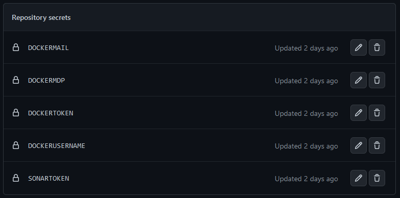
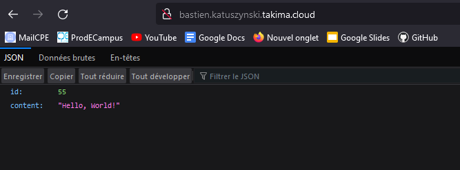
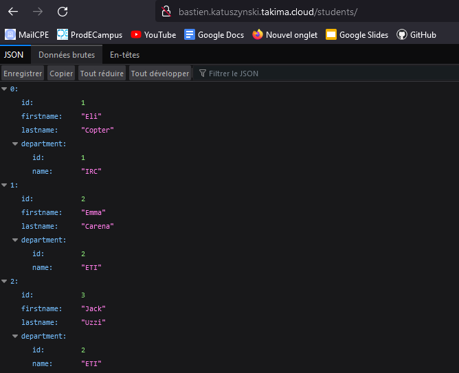

## Bastien KATUSZYNSKI
## Maxime LEFEBVRE

___

# TP1 - Docker

## Database
Création d'un dossier
``` bash
mkdir tp1
cd tp1/
touch Dockerfile
```
``` bash
docker pull postgres
```
Ecriture du dockerfile :
``` bash
nano Dockerfile
```
>
``` dockerfile
FROM postgres:14.1-alpine
ENV POSTGRES_DB=db \
POSTGRES_USER=usr \
POSTGRES_PASSWORD=pwd
```
Création de l'image
``` bash
docker build -t bastienkatus/postgres
```

Run l'image :
``` bash
docker run -p 8888:5000 --name postgres bastienkatus/postgres
```
Initialisation de la database :
``` bash
docker network create app-network
```
``` bash
docker run -p "8090:8080" --net=app-network --name=adminer -d adminer
```
Création du schéma SQL :
``` sql
touch 01-CreateScheme.sql
nano 01-CreateScheme.sql

CREATE TABLE public.departments
(
 id      SERIAL      PRIMARY KEY,
 name    VARCHAR(20) NOT NULL
);

CREATE TABLE public.students
(
 id              SERIAL      PRIMARY KEY,
 department_id   INT         NOT NULL REFERENCES departments (id),
 first_name      VARCHAR(20) NOT NULL,
 last_name       VARCHAR(20) NOT NULL
);
```
Insertion des données SQL :
``` sql
touch 02-InsertData.sql
nano 02-InsertData.sql

INSERT INTO departments (name) VALUES ('IRC');
INSERT INTO departments (name) VALUES ('ETI');
INSERT INTO departments (name) VALUES ('CGP');

INSERT INTO students (department_id, first_name, last_name) VALUES (1, 'Eli', 'Copter');
INSERT INTO students (department_id, first_name, last_name) VALUES (2, 'Emma', 'Carena');
INSERT INTO students (department_id, first_name, last_name) VALUES (2, 'Jack', 'Uzzi');
INSERT INTO students (department_id, first_name, last_name) VALUES (3, 'Aude', 'Javel');
```

On modifie le Dockerfile : (On copie les scritps SQL sur l'image)
``` dockerfile
COPY [Scripts SQL] /docker-entrypoint-initdb.d/
```
On rebuild et on rerun :
``` bash
docker build -t bastienkatus/postgres .

docker run --network app-network --name some-postgres -e POSTGRES_PASSWORD=pwd -d postgres-bastien
```
On se connecter à localhost:8090 et on peut accéder aux données


Pour la persistance des données :

On créé un volume
``` bash
mkdir volume
```
et on relance le run avec la commande
``` bash
docker run --network app-network --name some-postgres -e POSTGRES_PASSWORD=pwd -d postgres-bastien -v volume:/var/lib/postgresql/data
```

Question 1-1 :
Documenation au dessus.

## Java

On créé un fichier à la source /tpJAVA

On ouvre le Dockerfile et on y insère :

### JDK -> <u>Compiler</u>
``` dockerfile
FROM openjdk:11
# Build Main.java
# TODO : in next steps (not now)

# Executer un fichier java -> Construction de l'image 

COPY Main.java .
RUN javac Main.java
```

### JRE -> <u>Exécuter</u>

On rajoute la ligne
``` dockerfile
CMD ["java", "Main"]
```
On rebuild et on relance

Question 1.2 :
On a un multistage build car il faut d'abbord compiler puis executer le programme. Le dockerfile comprend une première partie permettant de copier le fichier Main.java puis de le RUN. La deuxième partie permet d'executer la commande java Main.

## Backend API

Docker-compose file :
``` dockerfile
# Build
FROM maven:3.8.6-amazoncorretto-17 AS myapp-build
ENV MYAPP_HOME /opt/myapp
WORKDIR $MYAPP_HOME
COPY /simpleapi/pom.xml .
COPY /simpleapi/src ./src
RUN mvn package -DskipTests

# Run
FROM amazoncorretto:17
ENV MYAPP_HOME /opt/myapp
WORKDIR $MYAPP_HOME
COPY --from=myapp-build $MYAPP_HOME/target/*.jar $MYAPP_HOME/myapp.jar

ENTRYPOINT java -jar myapp.jar
```

## Docker compose :

On supprime toutes les images
``` bash
docker rm -f .....
```

On télécharge le zip présent sur le git pour récupérer la correction de la première partie du TP

On vérifie la présence des tous les fichiers, notamment du .env contenant les variables d'environnement.

``` bash
docker-compose build
docker-compose up -d
```
Question 1-3 :
docker-compose build : Construire les services
docker-compose up : Lance tous les services
docker-compose down : Stop tous les services
docker-compose up -d : Lancer en arrière plan
docker ps : Lister les processus

Question 1-4 :
Documentation du docker-compose file :

Le Build :
* La commande `FROM` permet de récupérer un conteneur docker officiel maven.
* `ENV` permet de redéfinir l'environnement
* `WORKDIR` permet de définir le répertoire de travail
* `COPY` copie le pom.xml et le fichier src dans la VM
* `RUN` permet de lancer la commande `mvn package` pour compiler et build l'application

Le Run :
* Idem que le build pour `FROM`, `ENV` et `WORKDIR`.
* `COPY` copie le build créé juste avant dans la VM.

Pour la suite, on push toutes les images sur des repositories dockerhub

___

# TP2 - GitHub Action

Question 2-1 :
Les testcontainers sont des librairies java qui permettent d'executer un ensemble de conteneurs docker lors des test.

Création d'un fichier .github/workflows à la racine du projet et d'un fichier main.yml :
``` yml
name: CI devops 2023
on:
  #to begin you want to launch this job in main and develop
  push:
    branches: main 
  pull_request:

jobs:
  test-backend: 
    runs-on: ubuntu-22.04
    steps:
     #checkout your github code using actions/checkout@v2.5.0
      - uses: actions/checkout@v2.5.0

     #do the same with another action (actions/setup-java@v3) that enable to setup jdk 17
      - name: Set up JDK 17
        uses: actions/setup-java@v3
        with:
            java-version: '17'
            distribution: 'zulu''

     #finally build your app with the latest command
      - name: Build and test with Maven
        run: cd ./[chemin]/ simple-api mvn clean verify -e
```

Par la suite, on push ce fichier pour que github reconnaissance le github action.
On vérifie le bon fonctionnement des jobs dans l'onglet Action

Question 2-2 :
Comme c'est un .yml on a pas osé faire de commentaires car ca aurait tout casser.
* On a donc ajouter les actions sur la branche main
* On a ajouté une action pour le setup java.
* On a ajouté une action qui lance le maven clean et verify.

Ajout des secrets de Docker dans GitHub :


Construction des images docker dans le GitHub Action pipeline :
``` yml
name: CI devops 2023
on:
  push:
    branches: main
  pull_request: null
jobs:
  test-backend:
    runs-on: ubuntu-22.04
    steps:
      - uses: actions/checkout@v2.5.0
      - name: Set up JDK 17
        uses: actions/setup-java@v3
        with:
          java-version: "17"
          distribution: zulu
      - name: Build and test with Maven
        run: cd ./devops-resources-main/solution/01-docker/simple-api && mvn -B verify sonar:sonar -Dsonar.projectKey=BastienKatus_tpcicdbkml -Dsonar.organization=bastienkatus -Dsonar.host.url=https://sonarcloud.io -Dsonar.login=${{ secrets.SONARTOKEN }}  --file ./pom.xml

  build-and-push-docker-image:
    needs: test-backend
    runs-on: ubuntu-22.04
    steps:
      - name: Login to DockerHub
        run: docker login -u ${{ secrets.DOCKERUSERNAME }} -p ${{ secrets.DOCKERTOKEN}}
        
      - name: Checkout code
        uses: actions/checkout@v2.5.0
        
      - name: Build image and push backend
        uses: docker/build-push-action@v3
        with:
          context: ./devops-resources-main/solution/01-docker/simple-api
          tags: ${{secrets.DOCKERUSERNAME}}/tpdockercomposercorrection_backend:latest
          # build on feature branches, push only on main branch
          push: ${{ github.ref == 'refs/heads/main' }}
          
      - name: Build image and push database
        uses: docker/build-push-action@v3
        with:
          context: ./devops-resources-main/solution/01-docker/database
          tags: ${{secrets.DOCKERUSERNAME}}/tpdockercomposercorrection_database:latest
          # build on feature branches, push only on main branch
          push: ${{ github.ref == 'refs/heads/main' }}       
```

On publie les images sur dockerhub avec ces lignes à la suite du yml :
``` yml
- name: Build image and push httpd
        uses: docker/build-push-action@v3
        with:
          context: ./devops-resources-main/solution/01-docker/httpd
          tags: ${{secrets.DOCKERUSERNAME}}/tpdockercomposercorrection_httpd:latest
          # build on feature branches, push only on main branch
          push: ${{ github.ref == 'refs/heads/main' }}
```

Après avoir réaliser l'inscription à SonarCloud, nous avons du régler le conflit entre les CI, on a désactivé l'analyse automatique de Sonar Cloud.

On a ensuite réduit le pourcentage de coverage code afin de passer la quality gate. Car il y avait trop de problème de code et on attaignait un poucentage de seulement 56%. 

___

# TP3 - Ansible

Dans la VM, nous avons ajouté dans le fichier /etc/ansible/host le nom de domaine bastien.katuszynski.takima.cloud pour y accéder.

On a créé le fichier ansible/inventories/setup.yml :
``` yml
all:
 vars:
   ansible_user: centos
   ansible_ssh_private_key_file: /home/tp/tpGitAction/id_rsa
 children:
   prod:
     hosts: bastien.katuszynski.takima.cloud
```

Lancement de la commande pour tester l'inventaire :
``` bash
ansible all -i ./setup.yml -m ping
```

Lancement de la commande pour demander au serveur la distribution :
``` bash
ansible all -i ./setup.yml -m setup -a "filter=ansible_distribution*"
```

Lancement de la commande pour supprimer le serveur apache installer lors du TD :
``` bash
ansible all -i inventories/setup.yml -m yum -a "name=httpd state=absent" --become
```

Question 3-1 :
Documentation de l'inventaire
* On déclare l'utilisateur qui sera authentifié sur la VM (centos)
* On définit le chemin de la clé SSH
* On définit le nom de domaine de l'environnement de production.

Documentation des commandes au dessus.

## Playbooks

On créé un playbook dans le dossier ansible (playbook.yml)
``` yml
- hosts: all
  gather_facts: false
  become: yes

  tasks:
   - name: Test connection
     ping:

```
Et on éxecute le playbook :
``` bash
ansible-playbook -i ./setup.yml playbook.yml
```

On créé un advanced playbook dans le dossier ansible en remplacant l'ancient playbook.yml
``` yml
- hosts: all
  gather_facts: false
  become: yes
  roles:
    - docker
    - network
    - database
    - app
    - proxy

# Install Docker
  tasks:
  - name: Clean packages
    command:
      cmd: dnf clean -y packages

  - name: Install device-mapper-persistent-data
    dnf:
      name: device-mapper-persistent-data
      state: latest

  - name: Install lvm2
    dnf:
      name: lvm2
      state: latest

  - name: add repo docker
    command:
      cmd: sudo dnf config-manager --add-repo=https://download.docker.com/linux/centos/docker-ce.repo

  - name: Install Docker
    dnf:
      name: docker-ce
      state: present

  - name: install python3
    dnf:
      name: python3

  - name: Make sure Docker is running
    service: name=docker state=started
    tags: docker
```
Et on éxecute le advanced playbook :
``` bash
ansible-playbook -i ./setup.yml playbook.yml
```

Création d'un role docker :
``` bash
ansible-galaxy init roles/docker
```

Cette commande créé le dossier /roles/docker et on peut ensuite supprimer ceux que nous n'avons pas besoin :

``` bash
rm defaults/ && rm files/ && rm meta/ && rm templates/ && rm tests/ && rm vars/
```

Question 3-1 :
* On appelle tous les rôles à exécuter leurs tâches.
* On installe Docker (ca devrait être fait dans le main.yml du role Docker) et autres utilités au déploiement.

## Deploiement de l'application

Pour le déploiement, nous avons créé les roles pour chaque tâche de l'application.
* Docker pour l'installation de docker
* Network pour la création du réseau de communication des dockers
* Proxy qui fait tourner le httpd
* App qui contient le backend
* Database pour la base de données

Voici les playbook relatif à chacun de ces rôles :

### Network :
``` yml
# tasks file for roles/network
- name: Run NETWORK
  docker_network:
    name: app-network
```
Ici, on créé un conteneur docker qui s'occupe du réseau.

### Proxy :
```  yml
# tasks file for roles/proxy
- name: Run PROXY
  docker_container:
    name: httpd
    image: bastienkatus/tpdockercomposercorrection_httpd:latest
    networks: 
      - name: app-network
    ports:
      - 80:80
```
Ici, on créé un docker qui permet d'accèder au site web. Cela tourne sur un serveur apache.
On définit également la communication avec le conteneur Network en ouvrant le port TCP 80.

### App :
``` yml
# tasks file for roles/app
- name: Run BACKEND
  docker_container:
    name: backend
    image: bastienkatus/tpdockercomposercorrection_backend:latest
    networks: 
      - name: app-network
    ports:
      - 8080:8080
```
Conteneur qui contient le backend de l'application.
On définit également la communication avec le conteneur Network en ouvrant le port TCP 8080.


### Database :
``` yml
# tasks file for roles/database
- name: Run DB
  docker_container:
    name: database
    image: bastienkatus/tpdockercomposercorrection_database:latest
    networks: 
      - name: app-network
    env: 
      POSTGRES_DB: db
      POSTGRES_USER: usr
      POSTGRES_PASSWORD: pwd
```
Docker qui instore la database avec des variables d'environnement pour pouvoir accéder aux données et éxecuter les scripts.
On définit également la communication avec le conteneur Network.

Voici le playbook situé dans le répertoire d'ansible :
``` yml
- hosts: all
  gather_facts: false
  become: yes
  #On appelle les tasks de chacun des rôles
  roles:
    - docker
    - network
    - database
    - app
    - proxy

# Install Docker
  tasks:
  - name: Clean packages
    command:
      cmd: dnf clean -y packages

  - name: Install device-mapper-persistent-data
    dnf:
      name: device-mapper-persistent-data
      state: latest

  - name: Install lvm2
    dnf:
      name: lvm2
      state: latest

  - name: add repo docker
    command:
      cmd: sudo dnf config-manager --add-repo=https://download.docker.com/linux/centos/docker-ce.repo

  - name: Install Docker
    dnf:
      name: docker-ce
      state: present

  - name: install python3
    dnf:
      name: python3

  - name: Make sure Docker is running
    service: name=docker state=started
    tags: docker
```

Normalement le playbook n'est censé lancer que les rôles mais on y trouve l'installation du docker qui devrait être dans le playbook de `roles/Docker`.

On éxecute par la suite la commande
``` bash
ansible-playbook -i [chemin]./setup.yml playbook.yml
```

Nous pouvons tester sur la machine hôte avec les commandes :
``` bash
ssh -i [chemin vers la clé RSA] centos@bastien.katuszynski.takima.cloud

sudo docker ps
# Vérifier que toutes les images des dockers tournent sur la VM.
```

Nous pouvons donc bien accéder à notre application déployé via l'url bastien.katuszynski.takima.cloud




Question :
Documentation du docker_container tasks :
* On clean les packages
* on install device-mapper-persitent-data pour la persistance des données (enregistrement même si serveur redémarré)
* On installe lvm2
* On ajoute le repository docker
* On installe docker
* On installe python3
* On s'assure que docker est lancé

## Front

Nous n'avons pas eu le temps d'implémenter le front.

## Déploiement Continue

Nous n'avons pas eu le temps d'implémenter le déploiement continu.
